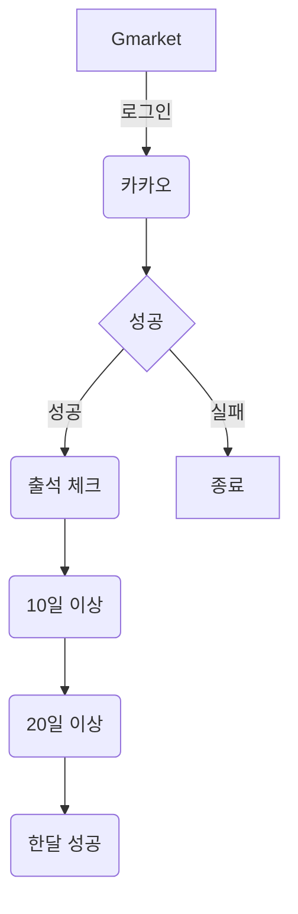

# Gmarket 출석 체크 프로그램

> 주의!! playwright의 Inspector 기능을 확인을 위한 프로젝트 입니다. 사용자 행위를 자동으로 만들어준 코드라 오류가 많이 발생 할 수 있습니다. 

## 필수 라이브러리 
- playwright
- dotenv

## 전체 행위 



## 실행 방법

```bash
# _env => .env로 변경
# .env에 ID/PW 작성(카카오 계정 기준)

# node 모듈 설치
$ npm i
# 테스트 실행
$ npm run test
```